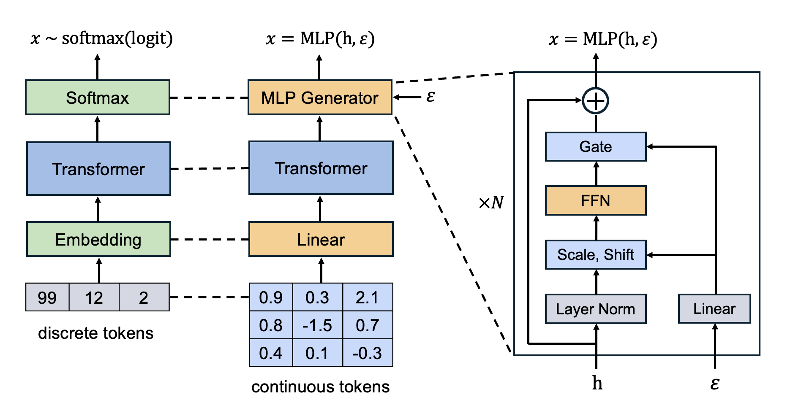

# Continuous Visual Autoregressive Generation via Score Maximization

The offical implementation of paper [Continuous Visual Autoregressive Generation via Score Maximization](https://arxiv.org/abs/) (ICML 2025).

<div align="center"></div>

## 🔥 Highlights

- 💡 **A principled framework for continuous VAR, theoretically grounded in [strictly proper scoring rules](https://sites.stat.washington.edu/raftery/Research/PDF/Gneiting2007jasa.pdf).**
- 🚀 **Likelihood-free learning with energy Transformer, supported by [energy score](https://eric-bunch.github.io/static/Szekely_estats.pdf$0).**
- 💪 **Experssive and efficient, overcoming key limitations of [GIVT](https://arxiv.org/abs/2312.02116) and [diffusion loss](https://arxiv.org/abs/2406.11838).**
- 🎉 **Competitive performance in both generation quality and inference efficiency.**


## Preparation

### Installation

A suitable [conda](https://conda.io/) environment named `ear` can be created and activated with:

```
conda env create -f environment.yaml
conda activate ear
```

### Dataset
Download [ImageNet](http://image-net.org/download) dataset, and place it in your `IMAGENET_PATH`.

### VAE
Download the continuous image tokenizer pre-trained by [MAR](https://github.com/LTH14/mar):

```
python util/download.py
```

### Caching VAE Latents

Caching the VAE latents to `CACHED_PATH` to save computations during training:
```
torchrun --nproc_per_node=8 --nnodes=1 --node_rank=0 \
main_cache.py \
--img_size 256 --vae_path pretrained_models/vae/kl16.ckpt --vae_embed_dim 16 \
--batch_size 128 \
--data_path ${IMAGENET_PATH} --cached_path ${CACHED_PATH}
```

## Training
Script for training EAR-B on 32 GPUs (750 epochs standard training + 50 epochs temperture fine-tuning). Adjust `--accumulation_steps` to train with a different number of GPUs.
```
torchrun --nproc_per_node=8 --nnodes=4 --node_rank=${NODE_RANK} --master_addr=${MASTER_ADDR} --master_port=${MASTER_PORT} \
main_ear.py \
--img_size 256 --vae_path pretrained_models/vae/kl16.ckpt --vae_embed_dim 16 --vae_stride 16 --patch_size 1 \
--score_lrscale 0.25 --train_temperature 1.0 --alpha 1.0 \
--model ear_base --scoreloss_d 6 --scoreloss_w 1024 --noise_channels 64 \
--epochs 750 --warmup_epochs 100 --batch_size 32 --blr 1e-4 --score_batch_mul 2 \
--cfg 3.0 --cfg_schedule linear --accumulation_steps 2 \
--output_dir ${OUTPUT_DIR} --resume ${OUTPUT_DIR} --online_eval --eval_freq 50 \
--use_cached --cached_path ${CACHED_PATH} --data_path ${IMAGENET_PATH}


torchrun --nproc_per_node=8 --nnodes=4 --node_rank=${NODE_RANK} --master_addr=${MASTER_ADDR} --master_port=${MASTER_PORT} \
main_ear.py \
--img_size 256 --vae_path pretrained_models/vae/kl16.ckpt --vae_embed_dim 16 --vae_stride 16 --patch_size 1 \
--score_lrscale 0.25 --train_temperature 0.99 --infer_temperature 0.7 --alpha 1.0 \
--model ear_base --scoreloss_d 6 --scoreloss_w 1024 --noise_channels 64 \
--epochs 800 --warmup_epochs 100 --batch_size 32 --blr 7e-5 --score_batch_mul 2 \
--cfg 3.0 --cfg_schedule linear --accumulation_steps 2 \
--output_dir ${OUTPUT_DIR} --resume ${OUTPUT_DIR} --online_eval --eval_freq 5 \
--use_cached --cached_path ${CACHED_PATH} --data_path ${IMAGENET_PATH}
```
To train EAR-L, set `--model ear_large` and adjust the size of MLP generator to  `--scoreloss_d 8 --scoreloss_w 1280`. To train EAR-H, set `--model ear_huge` and adjust the size of MLP generator to  `--scoreloss_d 12 --scoreloss_w 1536`.


## Evaluation

Evaluate EAR-B with classifier-free guidance:
```
torchrun --nproc_per_node=8 --nnodes=1 --node_rank=0 \
main_ear.py \
--model ear_base --scoreloss_d 6 --scoreloss_w 1024 \
--eval_bsz 128 --num_images 50000 \
--num_iter 64 --cfg 3.0 --cfg_schedule linear --infer_temperature 0.7 \
--output_dir ${OUTPUT_DIR} \
--resume ${OUTPUT_DIR} \
--data_path ${IMAGENET_PATH} --evaluate
```


## Acknowledgements
Our code is based on [MAR](https://github.com/LTH14/mar). Thanks for their great work.

## Citation
If you find the resources in this repository useful, please cite as:
```
@inproceedings{shao2025ear,
  author = {Shao, Chenze and Meng, Fandong and Zhou, Jie},
  title = {Continuous Visual Autoregressive Generation via Score Maximization},
  booktitle = {Proceedings of the 42th International Conference on Machine Learning, {ICML} 2025},
  year = {2025}
}
```
